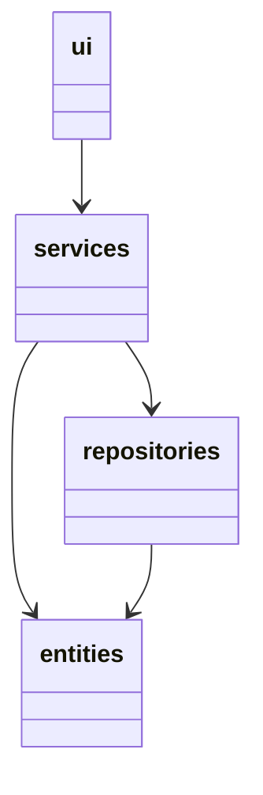
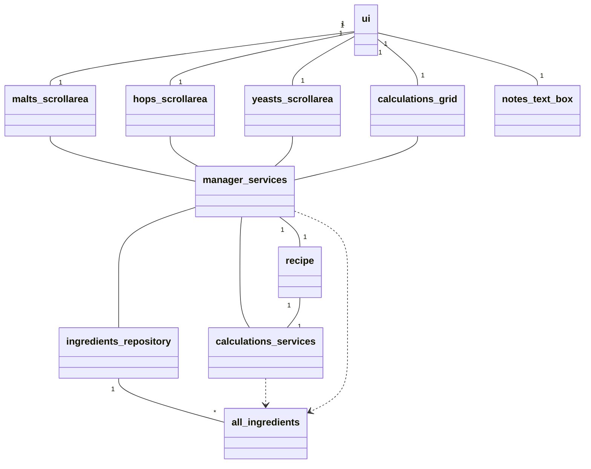
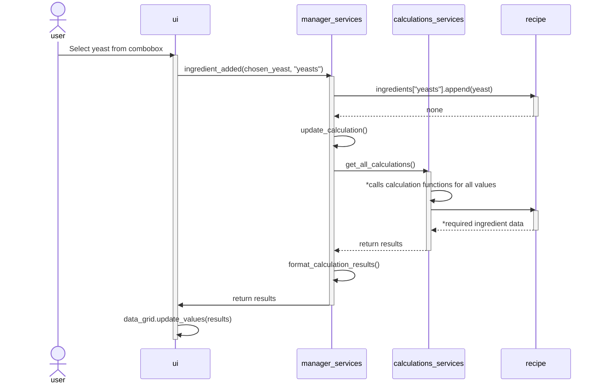
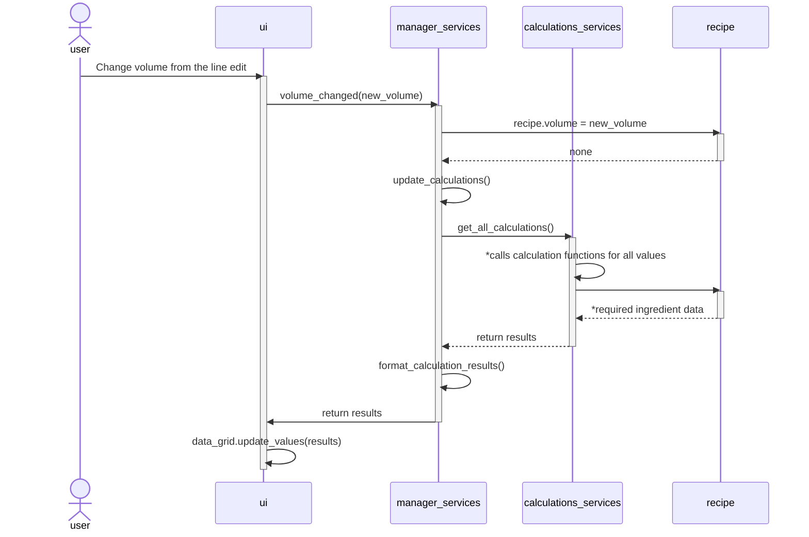

# Arkkitehtuuri

## Sovelluksen rakenne

### Koodin pakkausrakenne

Hakemisto *ui* vastaa käyttöliittymästä, *services* hoitaa sovelluslogiikan sekä laskennan, *repositories* kommunikoi tietokantojen kanssa ja *entities* hakemistossa määritellään luokkia, jotka esittävät ainesosia ja reseptiä.

### Luokkarakenne

## Tietokannat

Sovelluksella on kolme tietokantaan, jokaiselle pääainesosalle (Maltaat, humalat ja hiivat). Jokaiselle tietokannalle on oma repository-luokka, joka vastaa tiedon hakemisesta tietokannoista. Tulevaisuudessa näihin luokkiin voidaan lisätä ominaisuudet tiedon lisäämiselle ja poistamiselle tietokannoista.

## Toiminnallisuutta
Sovelluksen perustoiminnallisuuksia kuvattuna sekvenssikaavioina.

### Ainesosan (hiivan) lisääminen reseptiin GUI:n kautta

### Reseptin koon muuttaminen

*:lla merkatut: get_all_calculations funktio suorittaa kaikki muut calculations_servicesissä määritellyt funktiot ja palauttaa niiden tulokset. Jokainen näistä funktioista hakee recipe-oliosta tarvittavat tiedot.

### Muut toiminnallisuudet

Kuten kahdesta aikaisemmasta kaaviosta huomaa, useat sovelluksessa tehtävät muutokset reseptiin noudattavat pitkälti samaa kaavaa. Aine valitaan ja lisätään reseptiin, jonka jälkeen suoritetaan laskut uudestaan ja päivitetään uudet tiedot näkyviin käyttäjälle.
