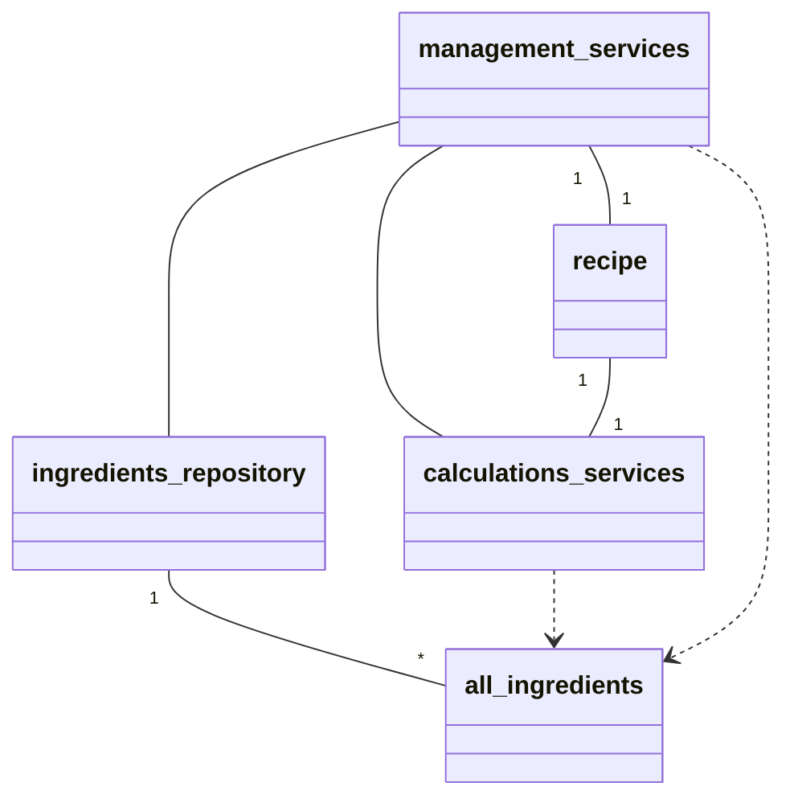
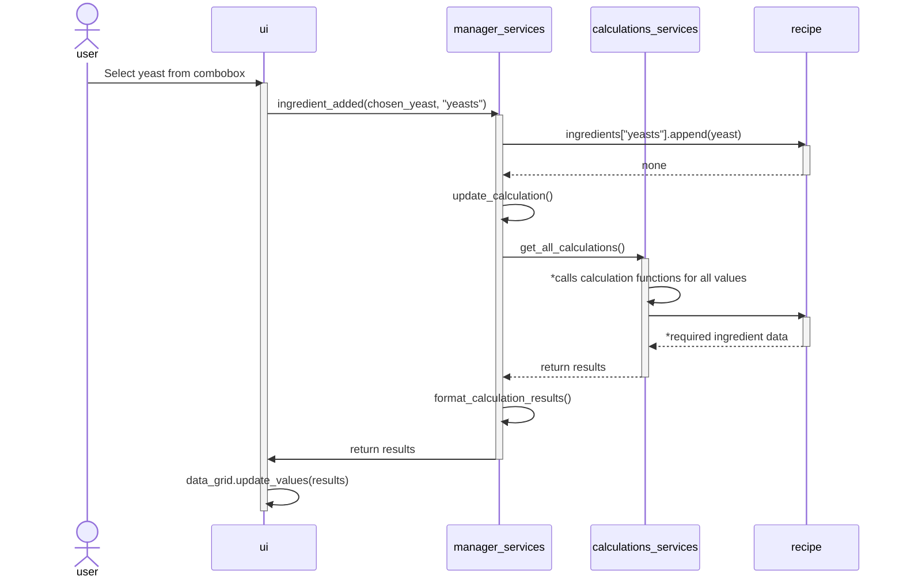

#Arkkitehtuuri

## Alustava rakenne
Päivitetään, kun GUI otetaan käyttöön.

## Toiminnallisuutta
Sovelluksen perustoiminnallisuuksia kuvattuna sekvenssikaavioina.

### Ainesosan (hiivan) lisääminen reseptiin GUI:n kautta

*:lla merkatut: get_all_calculations funktio suorittaa kaikki muut calculations_servicesissä määritellyt funktiot ja palauttaa niiden tulokset. Jokainen näistä funktioista hakee recipe-oliosta tarvittavat tiedot.