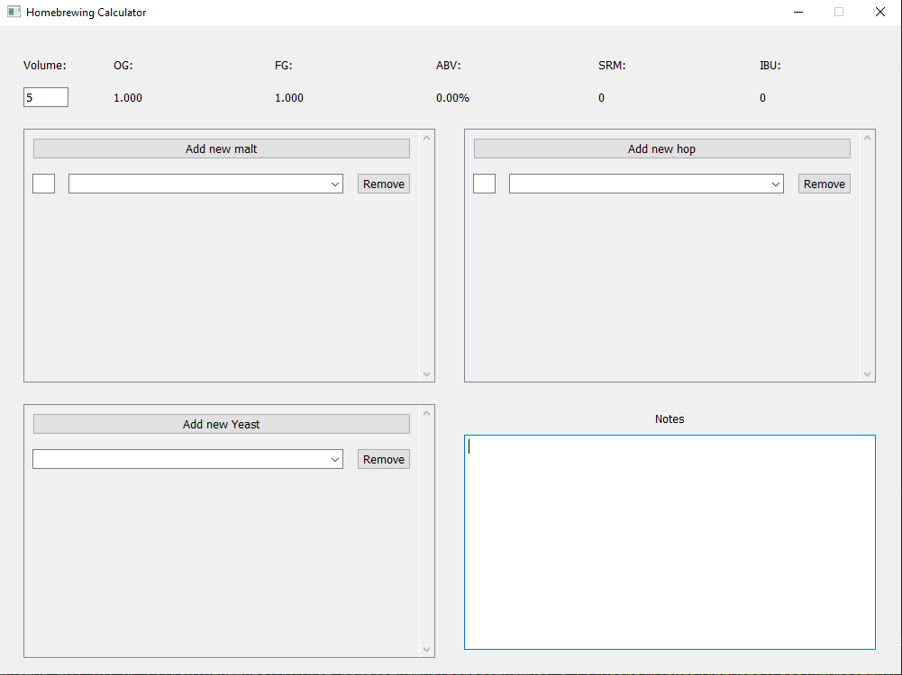
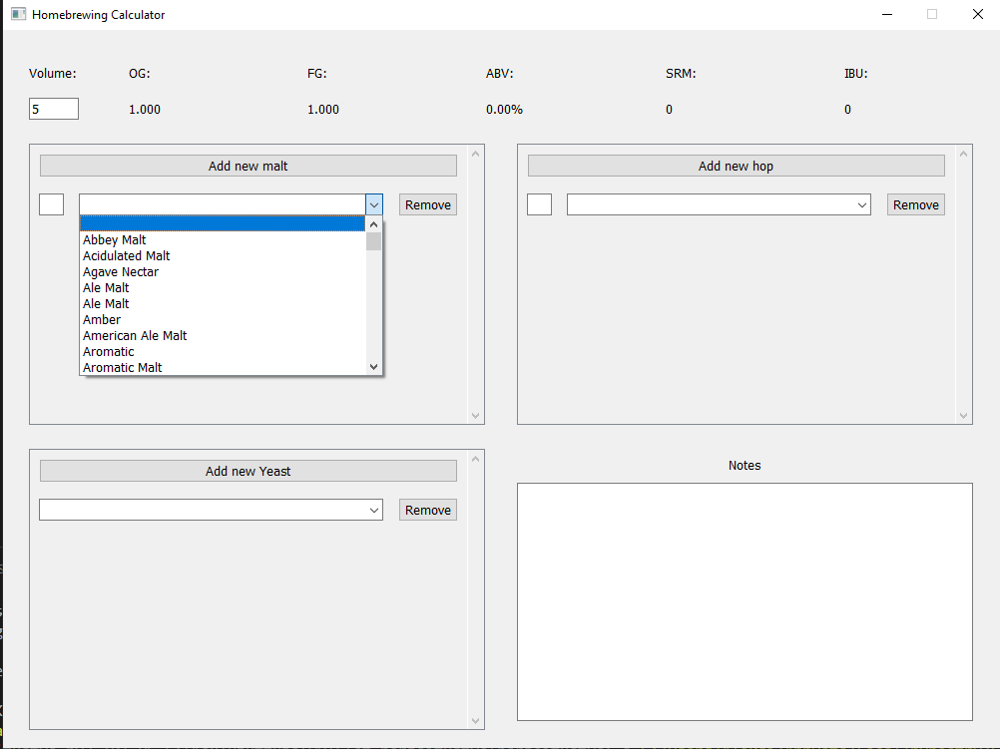
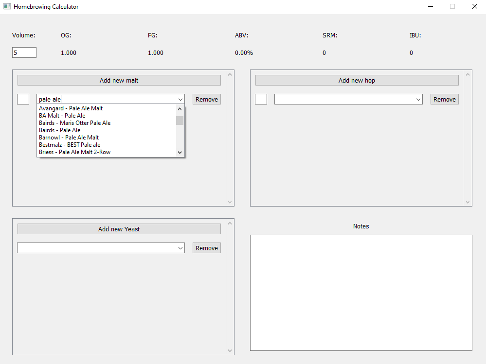
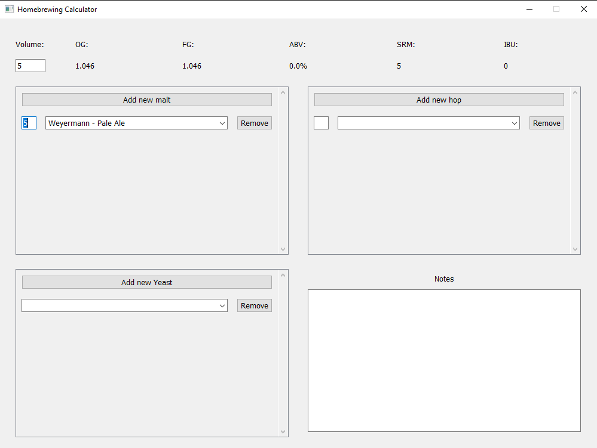
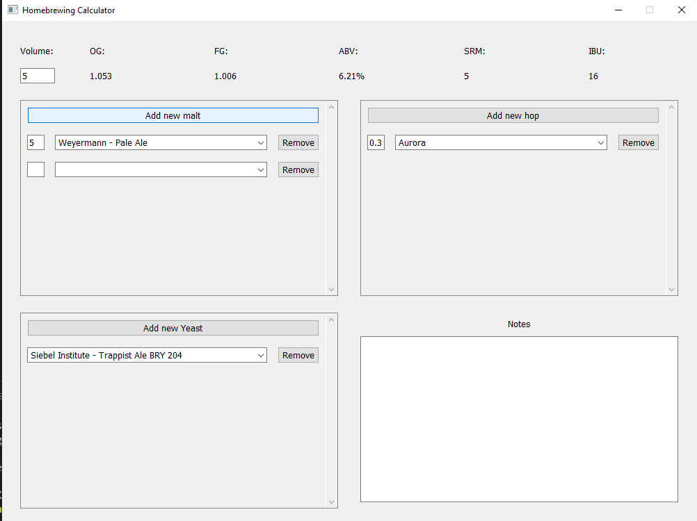
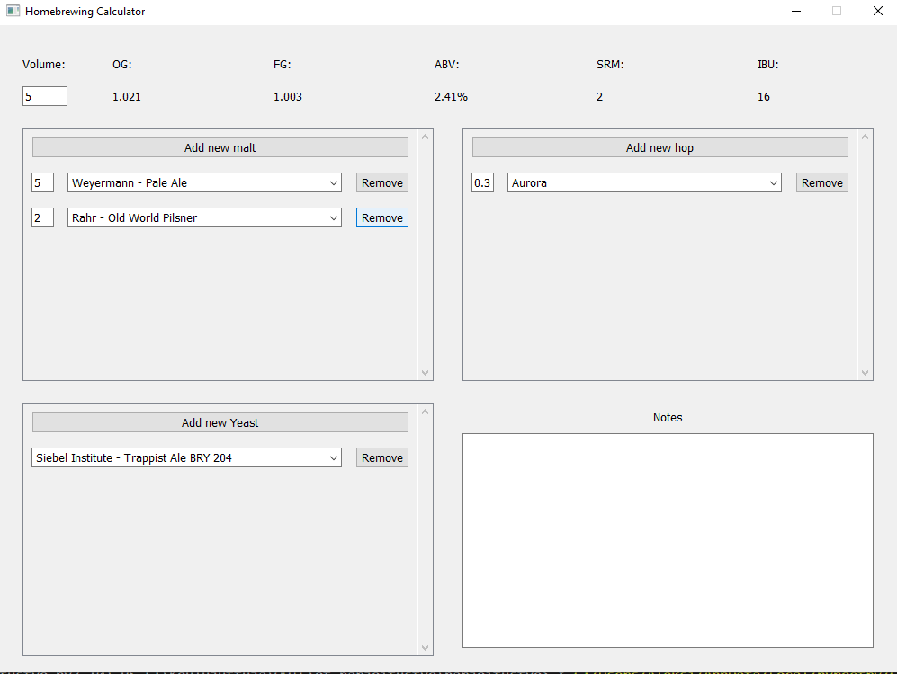
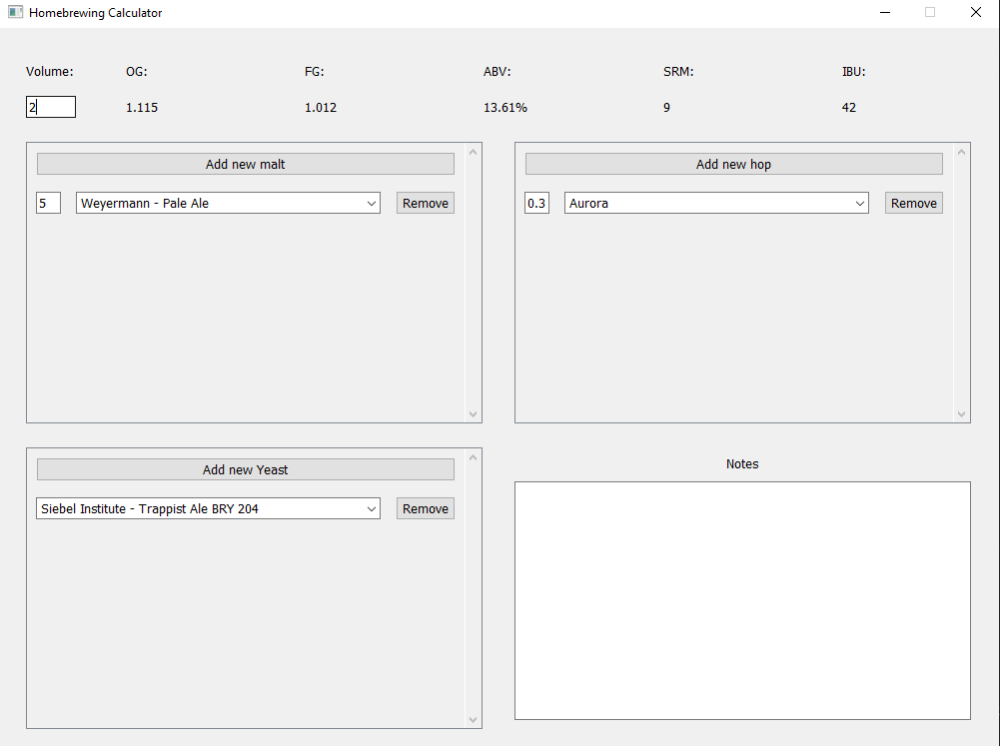

# Käyttöohje

Aloita lataamalla viimeisimmän [releasen](https://github.com/AleksiSaxlund/ot-harjoitustyo/releases) lähdekoodi.

## Ohjelman käynnistäminen

Ensimmäisellä käynnistyskerralla asenna riippuvuudet komennolla:

```
poetry install
```

Ohjelma ei vaadi erillistä konfigurointia. Voit käynnistää sen suoraan komennolla:

```
poetry run invoke start
```

## Huomioitavaa

Ohjelma ei toimi, jos */src/* tai */data/* hakemistojen sisällä olevia tiedostoja poistetaan, tai niiden nimiä muutetaan.

## Ohjelman käyttäminen

Sovellus aukeaa suoraan reseptinsuunnittelu näkymään:



Uusia ainesosia voi lisätä reseptiin pudotusvalikoista:



Ainesosia voi etsiä kirjoittamalla ainesosan nimi pudotusvalikkoon:



Ainesosien määriä voi muuttaa kirjoittamalla uuden määrän pudotusvalikon viereiseen tekstikenttään:



Uusia ainesosia voi lisätä painamalla "Add new" nappia: 



Ainesosat voi poistaa painamalla pudotusvalikon oikeanpuolista "Remove" nappia:



Reseptin kokoa voi muuttaa kirjoittamalla uuden määrän "Volume:" otsikon alapuolella olevaan tekstikenttään:



Kuten kuvista huomaa, reseptille lasketut arvot muuttuvat jokaisen muutoksen jälkeen vastaamaan uusia arvoja.
