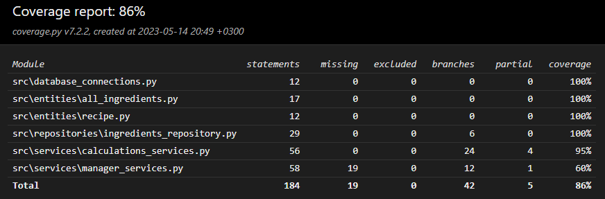

# Testausdokumentti

Ohjelmistoa on testattu yksikkö- ja integraatiotasolla. Moni luokka on riippuvainen vähintään Entities hakemiston luokista, joten yksikkötesteissä on vähintään ne mukana.

## Yksikkö- ja integraatiotestaus

Yksikkö- ja integraatiotestiluokkia kirjoitettiin luokille *calculations_services*, *ingredients_repositories* sekä *manager_services*. Laskujen suorittamisesta vastuussa oleva *calculations_services* on kattavimmin testattu sen keskeisyyden koko ohjelmistolle vuoksi. Kaikkien metodien perustoiminta testattiin kyseisessä luokassa yksikkötestein.

*Ingredients_repository* luokille luotiin testit, joilla lähinnä varmistetaan, että tieto haetaan tietokannoista oikeassa formaatissa. Näiden testien heikkous on se, että ne olettaa tietokannan sisällön olevan samanlainen, kuin kovakoodattujen testien testiarvot. Tämä on tietysti muutettava viimeistään, jos ohjelmaan lisää mahdollisuuden muokata tietokantoja.

*Manager_services* luokalle testataan, että se lisää ainesosia reseptiin oikealla tavalla. Tämä luokka olisi ansainnut enemmän erilaisia testejä testaamaan muitakin ominaisuuksia.

Integraatiotestauksen kautta kaikki luokat käyttöliittymän ulkopuolella saivat ainakin jonkinlaisen haaraumakattavuuden, vaikka niille ei olisikaan kirjoitettu erillisiä testejä. Luokat on eritelty toisistaan, mutta */Entities/* hakemistossa olevat luokat ovat keskeisessä roolissa koko sovelluksen logiikassa, joten niitä tuli testattua samalla myös kaikissa testiluokissa. Nämä entities-luokat ovatkin metodittomia luokkia, joten niille ei olisi ollut järkevä alkaa kirjoittaa erillisiä testejä.

## Testikattavuus

Haarautumakattavuus on 86% käyttöliittymäkerrosta lukuunottamatta.

## Järjestelmätestaus

Järjestelmätestaus on manuaalisesti käsin suoritettua.

### Asennus

Sovellusta on testatty [käyttöohjeen](./kayttoohje.md) opastamalla tavalla Windows 10- sekä Linux ympäristöissä.

### Toiminnallisuuksien testaus

Sovelluksen toiminnallisuudet on testattu syöttämällä virheellisiä, tyhjiä sekä oikeita arvoja syötekenttiin. Sovelluksen laskujen tulokset saattavat olla ajoittain epätarkkoja, mutta se ei johdu siitä, että ohjelmassa olisi virheellistä koodia. Tästä lisää [vaativuusmäärittelyn](./vaativuusmaarittely.md) "Ohjelman rajoituksia oluenpanijan näkökulmasta"-osiosta.

## Sovellukseen jääneet tunnetut bugit

- Ainesosia lisätessä niiden oletusmäärä on 0. Tämä määrä pysyy kunnes ainesosan määrä päivitetään vastaavasta syötekentästä.

## Varautumattomia virhetilanteita

- Ohjelmisto olettaa, että */data/*, sekä */src/* hakemistoissa oleviin tiedostoihin ei ole tehty muutoksia tai, että niitä ei ole poistettu. Sovellus saattaa kaatua tai tuottaa virhekoodin, jos lähdekoodiin tai kyseisten hakemistojen tiedostoihin on tehty muutoksia.
