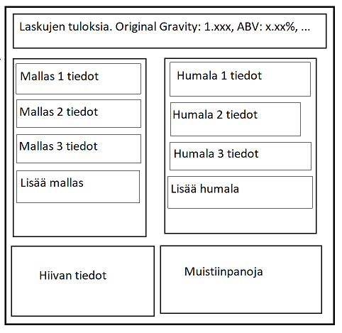

# Vaativuusmäärittely

## Sovelluksen tarkoitus

Sovelluksen tarkoitus on olla käyttäjälle työkalu erilaisten kotipanimo reseptien suunnittelussa. Sovelluksessa voidaan lisätä eri ainesosia valittuun reseptiin ja tarvittavat laskut suoritetaan automaattisesti käyttäjän nähtäväksi.

## Toiminnallisuus

### Toteutettu toiminnallisuus

- Käyttäjä voi lisätä tietokannasta maltaita, humalia sekä hiivoja reseptiin
- Käyttäjä voi määrittää erän suuruuden
- Jokaisen lisäyksen jälkeen ainakin seuraavien arvojen oletukset lasketaan ja näytetään käyttäjälle
  - Original Gravity
  - Final Gravity
  - ABV
  - IBU
  - SRM
- Käyttäjä voi itse kirjoittaa erillisiä muistiinpanoja reseptistä

## Ohjelman rajoituksia oluenpanijan näkökulmasta

Monissa ohjelman laskennallisissa toiminnoissa käytetään oletusarvoja joillekkin muuttujille. Tämä tarkoittaa, että laskut eivät aina ole niin tarkkoja, kuin olisi mahdollista.

Huomattavimmat epätarkkuudet löytyy IBU-arvon laskemisessa, jossa ei tällä hetkellä pysty muuttamaan humalien keittoaikaa ja reseptin ominaispainolla ei myöskään ole vaikutusta IBU-arvon muodostumiseen. Lisää IBU:n laskemisesta löytyy [täältä](http://www.highwoodsbrewing.com/ibu.php).

## Käyttöliittymäluonnos

Lopullinen käyttöliittymä vastaa alussa tehtyä luonnosta pitkälti. Suurin varsinainen ero on aloitusruudun puuttuminen. Nykyisessä versiossa sovellus aukeaa suoraan reseptin suunnitteluikkunaan ja reseptien lataus/tallennusominaisuutta ei ole olemassa.
