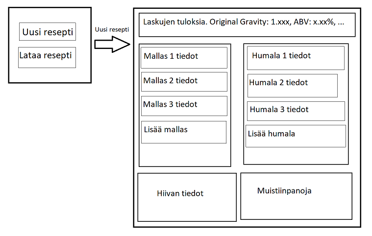

# Vaativuusmäärittely

## Sovelluksen tarkoitus

Sovelluksen tarkoitus on olla käyttäjälle työkalu erilaisten kotipanimo reseptien suunnittelussa. Sovelluksessa voidaan lisätä eri ainesosia valittuun reseptiin ja tarvittavat laskut suoritetaan automaattisesti käyttäjän nähtäväksi.

## Toiminnallisuus

### Perusversio

- Käyttäjä voi lisätä tietokannasta maltaita, humalia sekä hiivoja reseptiin (tehty)
- Käyttäjä voi myös lisätä tietokantaan omia ainesosia
- Käyttäjä voi määrittää erän suuruuden (tehty)
- Jokaisen lisäyksen jälkeen ainakin seuraavien arvojen oletukset lasketaan ja näytetään käyttäjälle (tehty)
  - Original Gravity (tehty)
  - Final Gravity (tehty)
  - ABV (tehty)
  - IBU (tehty)
  - SRM (tehty)

### Jatkokehitysideoita

- Reseptit voidaan tallentaa erillisiin tiedostoihin
- Tallennettujen reseptien lataus tiedostosta
- CO2 laskeminen
- Muiden satunnaisten ainesosien lisääminen
- Käyttäjä voi valinta Yhdysvaltalaisen- tai metrijärjestelmän
- Väriä havainnoillistava kuva
- Käyttäjä voi itse kirjoittaa erillisiä muistiinpanoja reseptistä (tehty)

## Käyttöliittymäluonnos

Sovellus aukeaa pienempään ikkunaan, josta voi lopullisessa sovelluksessa valita uuden reseptin tai ladata olemassa olevan reseptin. Reseptin lataus ominaisuuden valmistuminen ei ole taattu, mutta se on luonnoksessa mukana, jotta aloitusikkuna ei vaikuta täysin turhalta. Aloitusikkunasta siirrytään varsinaiseen laskimeen, jossa on oma ruutu jokaiselle ainesosalle. Yläreunassa olevat arvot päivittyvät aina, kun ainesosiin tehdään muutoksia.
